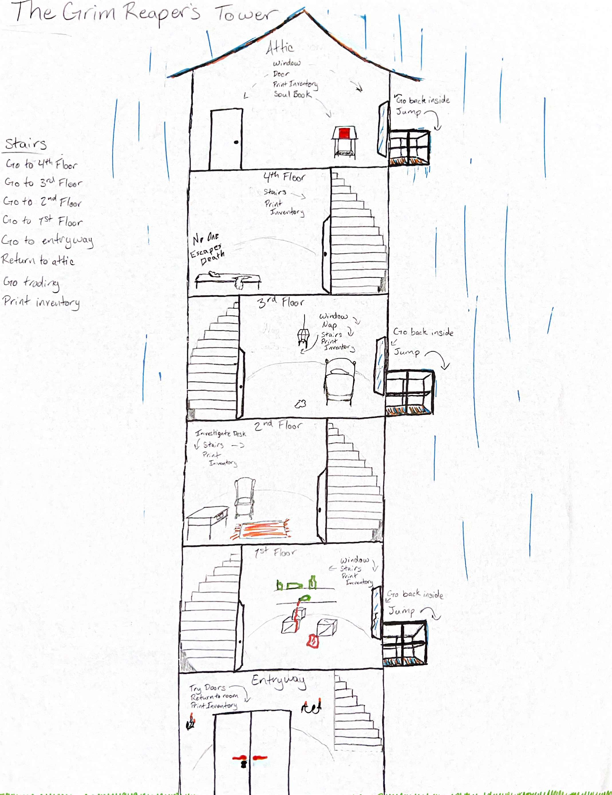

# EscapeTheGrimReapersTower

## Introduction

Welcome to The Grim Reaper's Tower. You have suddenly found yourself trapped inside it on the top floor. It is your goal to escape the tower. To do so you must make your way to the ground level where there is an entryway with a door, or you can jump out a window to the ground at your own risk. Before you can exit the front door, however, you must find the key that unlocks the entryway. There are other items that you can find along the way, that will help you, such as bread that can heal you.

In the mean time there are, also, enemies throughout the tower that can damage your health. One of which is the Grim Reaper! For an added challenge, you can create your own enemy, but you can change your mind and delete it.

Fork and clone this repo to play our cli based python game. Best of luck!

Take a look at the directory structure:

```console
.
├── Pipfile
├── Pipfile.lock
├── README.md
├── data
│    ├── default_enemies.py
└── lib
    ├── models
    │   ├── __init__.py
    │   ├── enemy.py
    │   ├── game.py
    │   ├── items.py
    │   ├── NonPlayChar.py
    │   ├── player.py
    │   └── rooms.py
    ├── cli.py
    ├── debug.py
    └── helpers.py
```


---

## Generating Your Environment

You might have noticed in the file structure- there's already a Pipfile!

Install any additional dependencies you know you'll need for your project by
adding them to the `Pipfile`. Then run the commands:

```console
pipenv install
pipenv shell
```

---

## Generating Your CLI

A command line interface(CLI) is, simply put, an interactive script and prompts the user and performs operations based on user input.

Enter in `python lib/cli.py` to get started!


---
### How the Game Works

The above command will display your introduction to the game. Once loaded, you will have 3 options to to proceed. 0 will exit the game, 1 will start the game, and 2 will take you to a form for creating a new enemy.
Choosing to create an enemy will allow you to access the create_enemy function of the Game class. After you create an enemy it will take you to a new menu, that allows you to again exit, start, or now you can delete the enemy(incase you changed your mind).
Starting the game, you will be prompted to create a player, by entering it's name. Then the game will start you out in the AtticRoom. From here you have 4 choices, the window, the door, check your inventory, or pick up the Soul Book. The window asks if you'd rather go back inside, or try your luck at jumping from the unknown height.
If you choose to pick up the Soul Book, you can take a look inside where you can get all the names who have come before you. You can also search for names and even set a soul free by choosing their name and deleting them from the book!
If you choose the door, you will find yourself on the stairs. From the stairs you have access to all the rooms, plus the exit, and a chance to see if a ghost has anything to offer you.

### The Tower's Layout?



---

## Contributors

Anne Hastings

Karen Hernandez

Holly Wheeler
___

Happy coding!
---

---

## Resources

- [Markdown Cheat Sheet](https://www.markdownguide.org/cheat-sheet/)
